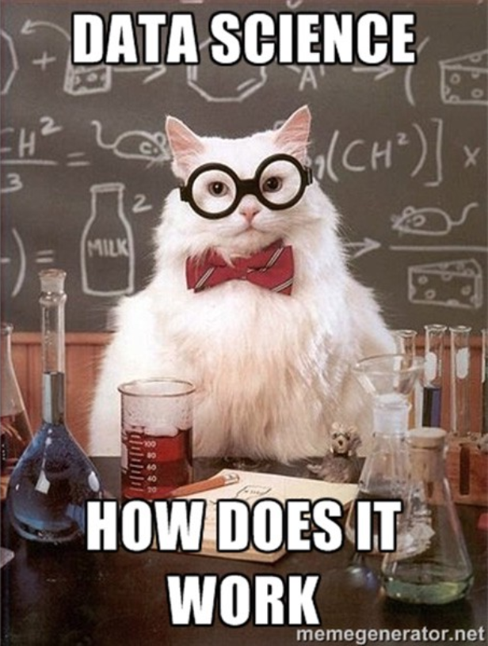
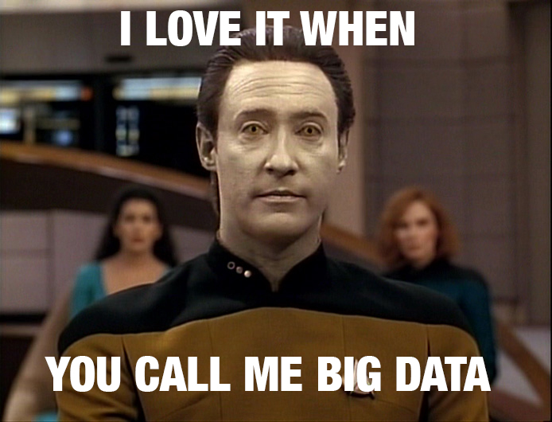

```{r setup, include=FALSE}
knitr::opts_chunk$set(echo = FALSE, out.width = "300px", out.height = "350px", fig.align="center")
```


## {.noborder}

```{r, out.width = 450, out.height = 600}

```


## Some Things That Aren't Data Science {.noborder}

## The Cloud$^{\mathrm{TM}}$ 

```{r, out.width = 1000, out.height = 600}
knitr::include_graphics('figs/what_if_I.jpeg')
```

## Deeeeeeeeeep Learning

```{r, out.width = 1000, out.height = 500}
knitr::include_graphics('figs/colors.jpg')
```

*credit: [Janelle Shane](https://aiweirdness.com/aboutme)*

## BIG DATA!!1!!

```{r, out.width = 800, out.height = 600}

```

## Data Science Is: 

> - Gathering **data that matters.**
> - Asking **questions that matter** about your data. 
> - **Choosing appropriate methods**  to answer those questions. 
> - **Implementing solutions** that meet stakeholder needs. 

## You Can Do Data Science With:

> - A pencil and paper.
> - A calculator.
> - Excel.
> - Coding: `R`, `Julia`, `Python`.... 

## Why Not Excel? 

<center>
<div id="left">
```{r, out.height = "440px", out.width = "375px"}
knitr::include_graphics('http://www.excel-easy.com/data-analysis/images/tables/excel-table.png')
```

</div>
</center>

<div id="right">
- **Flexibility:** 
	- Limited statistics/ML
	- Poor visualizations
- **Reproducibility:** 
	- Platform limited 
	- Can't version control
	- Difficult to inspect code/troubleshoot
- **Scalability:** 
	- Excel can handle ~1M rows at best
</div>

## Why Code?

<div id='left'>
```{r, out.height = "500px", out.width = "375px"}
knitr::include_graphics('http://rmarkdown.rstudio.com/images/notebook-demo.png')
```
</div>

<div id='right'>

- **Flexibility:**
	- "There's a package for that"
	- Custom analysis and visualization
- **Reproducibility:**
	- Cross-platform, often FOSS 
	- Version-control with `git`
	- Easy to inspect code
- **Scalability:** 
	- `R` and `python`: ~10M rows easily on a laptop.
	
</div>

## Version Control with `git` 

>- Break your workflow into manageable stages; easily collaborate; access cool code. 
>- Promote your brand: share your work, build a portfolio, [host your website](https://pages.github.com). 
>- Used at: Google, Facebook, Netflix, Amazon, Apple, Twitter, Microsoft... (*[source](https://www.quora.com/What-companies-use-Git)*)

## Data Analysis with  `R`

> - `R` is **the best** language in the world for **learning** data science.
> - `R` is **one of the best** languages in the world for **doing** data science. 
> - `R` tends to be preferred in academia and among "statisticians," while `python` is more popular among "computer scientists" and "data scientists"
> - Most practicing data scientists know and use both. 

## Optimization with `Julia` and `JuMP` 

>- `Julia` is high-performance, open-source dynamic language for technical computing -- easy writing, fast compute times.
>- Developed at MIT.
>- `JuMP` is a package for optimization in `Julia` -- developed by ORC students!
>- Not everyone uses `Julia`...yet. 

## *...yes, there will be an opportunity to learn `Python` later in the semester.* {.noborder}

## What can you pick up in two days? 

> - You are not going to become an expert in two days. 
> - But...
> - You will know the **basic concepts** and **vocabulary** of data science -- enough to employ the most important skill of all. 

## The most important skill of all... 

<center>

```{r, out.width = 1000, out.height = 600}
knitr::include_graphics('figs/monash_skills.png')
```

</center>

## The most important skill of all... 

<center>
```{r,  out.width = 750, out.height = 500}
knitr::include_graphics('http://searchengineland.com/figz/wp-content/seloads/2010/05/delete_facebook-500x438.png')
```
</center>

## Gameplan

1. **Today**: Version Control, Basic Data Analysis and Visualization in `R`, RMarkdown.
2. **Tomorrow**: Optimization in `Julia` and `JuMP`, selected presentations.
3. **Both days**: mini-project, partner work, lots of exercises. 

## Exercise 0

<div id='left'>
> 1. Look left.
> 2. Look right.
> 3. Pick a partner (groups of 3 are fine). 
> 4. Give them a professional, yet friendly smile. 
> 5. You are going to need them soon. 

</div>

<div id='right'>
<div class='fragment'>
```{r, out.width = 500, out.height = 300}
knitr::include_graphics('figs/0602-sir-patrick-stewart.jpg')
```
</div>
</div>


